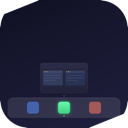
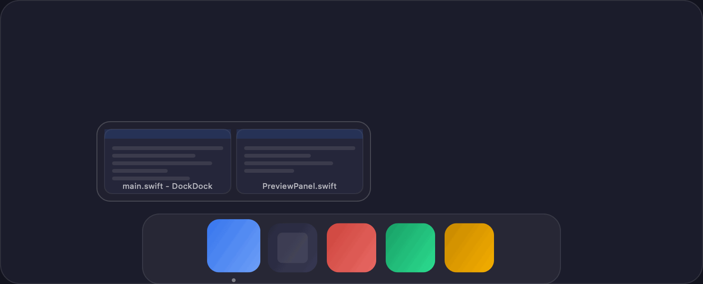

<div align="center">
  
  <h1>DockDock</h1>
  <p>Live window previews when you hover over Dock icons. Pure Swift, zero dependencies.</p>

  
  
  

  <p>
    
  </p>
</div>

---

## What it does

Hover over any icon in the Dock and DockDock shows a floating panel with live thumbnails of every open window for that app. Click a thumbnail to bring the window into focus, or use the context menu to minimize or close it.

Special panels are included for **Spotify** (album art, progress bar, playback controls) and **Finder** (all open windows in a mosaic view). For apps that aren't running yet, DockDock shows a lightweight placeholder with a one-click **Open** button.

## Features

- **Window previews:** hover any Dock icon to see open windows as live thumbnails
- **Spotify panel:** album art, track info, progress bar and playback controls
- **All Windows view:** Finder-style mosaic for apps with many open windows
- **Not-running apps:** placeholder panel with a direct Open button
- **Window actions:** focus, minimize or close any window from the preview
- **Zero footprint:** lives in the menu bar, no Dock icon of its own

## Requirements

- macOS 14 Sonoma or later
- **Accessibility** permission: required to detect Dock icons and manage windows
- **Screen Recording** permission: optional, enables live window thumbnails

## Build & Run

```bash
git clone https://github.com/AlbertoBarrago/DockDock.git
cd DockDock

# Debug build → installs to /Applications/DockDock.app
bash bin/make-app.sh

# Release build → installs to /Applications/DockDock.app
bash bin/make-release.sh
```

Or open `Package.swift` in Xcode and press **Cmd+R**.

> **Tip:** after each new build, macOS may require you to re-grant Screen Recording in System Settings → Privacy & Security. The permission is tied to the binary hash.

## Architecture

```
Sources/DockDock/
├── App/
│   ├── DockDockApp.swift       # @main entry point
│   └── AppDelegate.swift       # lifecycle, menu bar, Combine subscriptions
├── Core/
│   ├── DockObserver.swift      # global mouse tracking + AX Dock icon detection
│   ├── WindowCapture.swift     # ScreenCaptureKit (14.2+) with CGWindowList fallback
│   ├── PermissionManager.swift # Accessibility + Screen Recording gating
│   └── WindowInfo.swift        # window model
├── UI/
│   ├── PreviewPanel.swift      # floating NSPanel: routing, positioning, animation
│   ├── PreviewGridView.swift   # thumbnail grid
│   ├── NotRunningAppView.swift # placeholder for dormant Dock icons
│   └── ThumbnailView.swift     # single thumbnail + context menu
├── Features/
│   ├── SpotifyController.swift # AppleScript bridge and artwork loading
│   └── WindowManager.swift     # focus / minimize / close via AXUIElement
└── Settings/
    ├── AppSettings.swift       # @AppStorage preferences
    └── SettingsView.swift      # settings window
```

**Notable design decisions**

- AX children enumeration (not hit-test): reliable on macOS 14/15 where hit-test misfires
- Bundle ID matching in SCKit: handles multi-process apps like Firefox and Electron shells
- `debouncingID` guard: prevents debounce restart on every mouse-move over the same icon
- `CombineLatest($hoveredApp, $windows)`: panel refreshes automatically when async capture completes
- Property assignment order in debounce tasks avoids a `(nil, nil)` CombineLatest flash during icon transitions
- Binary-preserving bundle update: `make-app.sh` never deletes the `.app`, keeping TCC permissions intact

## License

MIT © Alberto Barrago
